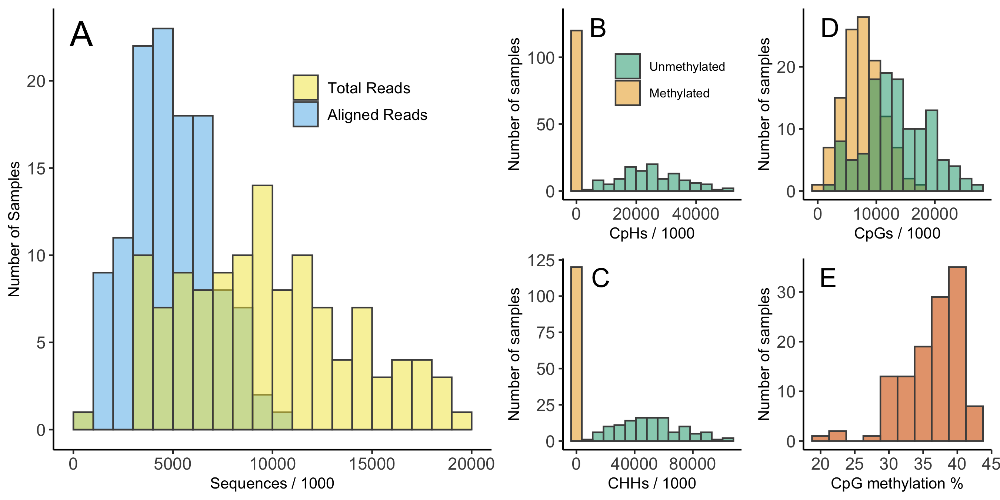

```{r setup, include = FALSE, echo = FALSE}
knitr::opts_chunk$set(echo = FALSE, warning = FALSE, message = FALSE)
```

\raggedright

## ABSTRACT


*Keywords: reduced representation bisulfite sequencing, stress, endocrinology, carryover effects*

## INTRODUCTION

Wild animals regularly encounter challenging conditions that require rapid behavioral and physiological responses. In vertebrates, the glucocorticoid mediated stress response plays an essential role in allowing animals to successfully avoid or tolerate stressors [@sapolsky2000; @wingfield1998]. While an appropriate response is beneficial [@wingfield1998], an inappropriate or prolonged elevation of glucocorticoids can result in a variety of well described costs [@korte2005]. Given the way that these benefits and costs can change over time or between contexts, flexible regulation of the acute stress response may itself be an important determinant of coping ability [@taff2016; @hau2016; @wada2014]. Measuring these within-individual reaction norms in endocrine traits is difficult, but has the potential to clarify why some individuals succeed when others fail during challenging conditions. However, a full understanding of how flexibility contributes to coping ability also requires identifying the mechanism(s) that contribute to flexible adjustment of the acute stress response. 

Changes in DNA methylation in response to prior challenges represent one mechanism that could play a role in the calibration of stress response systems. Epigenetic modification by DNA methylation can alter phenotypes by making genes or promoters more or less accessible for transcription [@lea2018; @sepers2019; @anastasiadi2018]. It is well known that early life experiences can have profound programming effects on DNA methylation patterns that often persist throughout the lifetime [e.g., @mcgowan2009]. For example, classic work in lab rodents demonstrates that early life experiences regulate methylation of the gene producing the glucocorticoid receptor, which results in lifelong changes to glucocorticoid secretion in response to challenges [@liu1997; @weaver2004]. A growing number of studies also demonstrate early life programming of DNA methylation patterns in wild populations resulting from dominance hierarchies [@laubach2019], brood size [@jimeno2019; @sheldon2018], temperature [@metzger2017], or landscape features [@kartzinel2022].

While they are less well documented, experiences during adulthood can also result in changes in DNA methylation and these adjustments can occur rapidly [@metzger2017; @bentz2021]. For example, brief periods of experimental competition and aggression in tree swallows (*Tachycineta bicolor*) resulted in altered DNA methylation of brain regions associated with hormone signaling, suggesting a priming effect in preparation for future aggression [@bentz2021]. Conceptual models of the stress response have long recognized that the sequence, frequency, duration, and intensity of stressors should change the optimal behavioral and physiological response [@romero2009]. Yet it is often unclear how the experience of challenges during adulthood would be biologically encoded to alter responses to future challenges. Altered DNA methylation is a promising mechanism because i) it can change rapidly even during adulthood, ii) it can persist over moderate to long time scales, iii) it has been shown to change with challenging experiences, and iv) it may play a direct role in physiological responses to future challenges. It has not yet been demonstrated, however, whether brief increases in corticosterone as an adult causally influence methylation patterns.

We studied covariation between DNA methylation and corticosterone (the primary avian glucocorticoid) in tree swallows using both observational and experimental approaches. In this population we previously found that genome wide methylation predicts resilience to experimental challenges [@taff2019] and that brief experimental increases in corticosterone have lingering effects on behavior and performance [@vitousek2018; @taff2018]. However, corticosterone and methylation have not been studied together and the methylation methods used previously did not allow for base-pair level resolution of changes in methylation status. Here, we used reduced representation bisulfite sequencing (RRBS) and a newly improved reference genome assembled for this study to examine genome wide patterns of DNA methylation at high resolution. We first assessed covariation between methylation and natural variation in corticosterone regulation during an acute stress response. Next, we experimentally simulated a series of acute corticosterone responses using a non-invasive dosing procedure [@vitousek2018] and compared DNA methylation to controls to determine whether brief increases in corticosterone resulted in altered DNA methylation at either short (1-2 weeks) or long (1 year) timescales. 

Given previous work demonstrating a correlation between coping ability and both genome-wide methylation [@taff2019] and natural variation in rapid corticosterone regulation [@vitousek2018f], we predicted that natural variation in corticosterone (baseline and stress-induced increase) would be associated with DNA methylation. However, a correlation here could arise through early life programming, prior activation of the acute corticosterone response, or any conditions that impact the regulation of both methylation and corticosterone (e.g., body condition). In contrast, for the experimental manipulation we predicted that differences in DNA methylation between control and treatment groups would only be present if brief increases in corticosterone have a causal effect on altering methylation patterns. We assessed the time course and persistence of any such changes using comparisons 1-2 weeks after treatments and 1 year after treatments. If methylation changes play a role in altering future corticosterone secretion then we expected to find more differences near genes and promoters associated with endocrine regulation. 

## METHODS

We studied tree swallows breeding at field sites in and around Ithaca, New York, U.S.A. from April to July of 2015 and 2016. This population of tree swallows has been continuously studied since 1986 and we followed well established monitoring protocols [for details see @winkler2020]. In 2015, adult females were captured on day 6 to 7 after the beginning of incubation and again on day 3 to 7 after eggs had hatched. In 2016, any returning females were captured on day 6 to 7 of incubation. At each capture we collected blood samples (< 70$\mu$l each) to measure baseline (< 3 minutes) and stress induced (30 minutes) corticosterone [@vitousek2018]. We also collected a set of standardized morphological measurements and monitored reproductive success [@vitousek2018]. All birds received a unique USGS aluminum band and passive integrated transponder (PIT) tag if they were not previously banded.

Between the first and second capture in year one, females were randomly assigned to either a control or experimental treatment group. In the experimental group, we simulated a brief spike in corticosterone once per day on five days between the two captures. To accomplish this, we applied two 60 $\mu$l doses of corticosterone dissolved in DMSO gel one hour apart to a fake egg anchored in the nest cup at a randomly chosen time during the day when females were absent from the nest. Upon returning, females incubated the clutch and absorbed the corticosterone across the skin on their brood patch. For the purposes of this study, we considered females as part of the corticosterone treatment group if they received any of the three dose concentrations described in Vitousek et al. 2018 (high = 4 mg ml ^-1^ corticosterone once plus sham once per day; low = 2 mg ml ^-1^ once plus sham once per day; long = 2 mg ml ^-1^ twice per day).

We previously validated that this dosing method results in a brief (< 180 minutes) increase in corticosterone within the range of natural acute corticosterone responses [@vitousek2018]. Control nests received either no manipulation or a sham control in which they were dosed as described above but with DMSO gel only with no corticosterone added. We previously found no difference in physiology, behavior, reproductive success, or survival between control and sham control birds receiving this treatment [@vitousek2018; @taff2018] and we combined both control groups in the analyses described here. 

*Tree swallow reference genome assembly*

For this study, we improved upon a previously published reference genome sequenced from a female from this study population [@taff2019]. We extracted fresh DNA from the same individual and submitted to Duke(?) for xxx sequencing. We combined the new sequence data with the xxx from previous work. List of tools and process for assembly. List of some characteristics of new genome, where to access, etc.

*Sample processing*

Blood samples collected in the field were immediately stored on ice in a cooler and processed in the lab within 3 hours of capture. Red blood cells were separated from plasma by centrifugation and added to 1 mL of ice cold cryopreservation buffer [90% newborn calf serum, 10% DMSO, @haussmann2008]. Samples were then frozen at a constant cooling rate in a Mr. Frosty container with isopropyl alcohol and stored at -80$^\circ$ C until further processing. Cryopreserved blood samples were thawed and DNA was extracted using the DNeasy Blood & Tissue spin column extraction kits according to the manufacturer's protocol. 

*Reduced representation bisulfite sequencing*

We prepared our samples for reduced representation bisulfite sequencing (RRBS) using the Diagenode Premium RRBS Kit and closely following the manufacturer's protocol [@veillard2016]. Briefly, samples were diluted to 3.85 ng/$\mu$l and 26 $\mu$l of diluted sample was used for library preparation. The process included enzymatic digestion with Mspl and size selection to increase coverage of CpG-rich regions, such as CpG islands and enhancers. Individual samples received one of twenty-four unique barcodes and were pooled in randomized groups of 8 before bisulfite conversion. We also included a methylated and unmethylated spike in control with each sample to confirm the efficiency of bisulfite conversion.

From the available samples, we selected 120 samples to process. These samples were chosen to maximize the power of our planned comparisons (i.e., preferentially birds with all 3 samples, then birds with just two samples). Prior to RRBS processing, these 120 samples were randomly sorted to account for any batch effects. Libraries were prepared with the Diagenode kit in two batches (one set of 24 and one of 96). Prepared libraries were checked for the expected size distribution by digital PCR prior to sequencing. Sequencing was performed at the Cornell BRC using NextSeq 1x75 with 20% PhiX and 85% of the normal cluster density. In total, we ran our samples on five sequencing lanes with 24 samples per lane.

Raw sequence data were first processed with `Trim Galore!` using the default RRBS settings. Visual inspection of FastQC files confirmed high quality reads for all samples. Next, we used `Bismark` to align each sequence to the prepared genome and extract the methylation status for each CpG, CpH, or CHH site [@krueger2011]. As expected, global methylation at CpH and CHH sites was extremely low (1.0% and 0.6%, respectively, Figure \@ref(fig:read-summary)) and we only considered methylation at CpG sites in our subsequent analyses. We also used `Bismark` to determine the methylation conversion efficiency for each sample based on methylated and unmethylated spike in controls and following the instructions in the Diagenode RRBS kit [@veillard2016; @krueger2011]. 

*Data analysis*

Output data from the sequence processing described above was analyzed in R version 4.1.1 [@rcite]. We initially processed the aligned sequence data using `MethylKit`, which includes a variety of functions for working with bisulfite sequencing data [@akalin2012]. Using `MethylKit`, we extracted the number of total aligned reads and number of methylated or unmethylated reads for each CpG site. 

For analyses of corticosterone and treatment associations, we filtered these CpGs to include only those that met the following criteria. First, we required a minimum coverage of 10 reads per sample to retain data for that sample at a given CpG. We further filtered the dataset to remove any CpGs that were mostly invariant (i.e., more than half of samples had methylation percentage of 0 or 100%) as well as CpGs that had extremely low variation (SD less than 5% across all samples). For models comparing treatment effects, we required that females have data at a given CpG from both pre and post treatment sampling points to be included. For basic descriptions of methylation patterns, we used all CpGs that had 10 reads or more in the pre-treatment samples.

The built in differential methylation techniques in `MethylKit` are designed for two group comparisons with limited flexibility in modeling options. Because we had repeated measures before and after treatments for both groups, we could not specify the necessary models within `MethylKit` itself. Therefore, we exported and combined the filtered CpG records for all groups so that we could fit generalized linear mixed models (GLMMs) for each CpG site [as in @lindner2021] using the `glmer` function in R package `lme4` [@bates2014]. We fit a separate set of models for natural corticosterone variation (baseline or stress-induced), within-year treatments, and between-year treatments. Each of these datasets were constructed separately since they included different subsets of both individual birds and of CpGs that met the criteria described above. 

For natural variation in corticosterone, we included only the pre-treatment samples from the first year of study. Using these samples, we fit a GLMM for each CpG with the number of methylated and unmethylated reads as the binomial response variable. We fit this set of models separately with baseline and stress-induced corticosterone as the single continuous predictor variable. The models included a random effect for female identity to account for repeated sequencing of the same CpG sites within each female. We excluded the results for any models that failed to converge because we could not reliably estimate effects in those cases.

For within year and between year comparisons after treatments, we fit a single GLMM for each included CpG with the number of methylated and unmethylated reads as the binomial response variable. Predictors included pre-treatment methylation percentage at the CpG being modeled, a fixed effect of treatment (control vs. corticosterone), and a random effect for female identity. In each model, significance of the comparison between control and corticosterone treated birds was assessed using the `emmeans` package in R [@emmeans]. We also evaluated the stability of methylation within individuals in these models by summarizing the regression coefficient of pre-treatment methylation on post-treatment methylation.

We accounted for multiple comparisons in each of these analyses by adjusting all p-values using the q-value approach implemented by the `qvalue` package in R with the false discovery rate set at 0.05 [@qvalue]. We only report and interpret estimates with q-values < 0.05. The complete set of R code and sample data is available on GitHub and will be publicly archived upon acceptance (www.github.com/cct663/tres_rrbs). Raw sequence data from RRBS is available at (**I guess this can go to NCBI?**). The assembled genome used for sequence alignment is available at (**??**). 

**Differential results tested to genes by...**

## RESULTS

*General methylation patterns*

Our process resulted in 9.8 $\pm$ 4.3 million (SD) total reads per sample (Figure \@ref(fig:read-summary)). Across all samples, we were able to align 51.1% of the total reads produced, which is comparable to several recent studies in wild birds [e.g., @makinen2019]. Spiked controls in each sample indicated that our bisulfite conversion worked efficiently and within the recommended kit parameters (conversion of methylated control sites = 1.9% $\pm$ 1.4; conversion of unmethylated control sites = 99.5% $\pm$ 0.6). 

Among 45 pre-treatment samples, we had sufficient coverage to estimate methylation at 148,167 CpGs. In total, the average percentage methylation across all sites was 35.5% $\pm$ 34.0 with a wide distribution (Figure \@ref(fig:sum-plot)A). After assigning CpGs hierarchically to promoter (within 2kb upstream of a TSS) > exon > intron, we found that 12.1% of sites were in promoters, 7.9% in exons, 11.8% in introns, and 68.1% in intergenic regions. At the level of genomic features, promoters had the lowest methylation (median = 5.3%, mean $\pm$ SEM = 20.5% $\pm$ 0.5), introns had intermediate methylation (median = 43.5%, mean $\pm$ SEM = 41.0% $\pm$ 0.5), and exons had the highest methylation (median = 54.3%, mean $\pm$ SEM = 46.7% $\pm$ 0.7). However, each of these features had a wide distribution of methylation percentages across different genes (Figure \@ref(fig:sum-plot)B).


*Association between natural or experimental corticosterone and methylation*

Using pre-treatment samples, we found that methylation percentage at 116 CpGs out of 78,143 tested was associated with baseline corticosterone after FDR correction (Figure \@ref(fig:volc-plot)A; Table  \@ref(tab:model-tab)). For stress-induced corticosterone, we found a similar association at 356 out of 78,027 CpGs that were tested (Figure \@ref(fig:volc-plot)B; Table \@ref(tab:model-tab)).

In models examining the causal effect of corticosterone treatment, we found that for samples collected within the same breeding season 1-2 weeks after treatment, 111 out of 48,070 CpGs tested showed evidence of differential methylation after FDR correction (Figure \@ref(fig:volc-plot)C; Table \@ref(tab:model-tab)). We had fewer individuals and fewer CpGs that passed filtering for comparisons one year after treatment, but we found that 49 out of 6,787 CpGs tested were differentially methylated between treatment and control groups after one year (Figure \@ref(fig:volc-plot)D; Table \@ref(tab:model-tab)). Although we were primarily interested in treatment effects, these models also showed that pre-treatment methylation at a given CpG site generally predicted post-treatment methylation both within a year (Figure \@ref(fig:rpt-sample)A) and for samples collected one year later (Figure \@ref(fig:rpt-sample)B).

```{r volc-plot, warning = FALSE, message = FALSE, fig.width = 7.8, fig.height = 6.6, fig.cap = "Association between DNA methylation and corticosterone from GLMMs based on observational and experimental study components. Panel A and B show the pre-treatment regression coefficient for baseline corticosterone and stress-induced corticosterone on methylation percentage, respectively. Panel C and D show the difference in methylation for control vs. treatment groups after accounting for pre-treatment methylation percentage for samples 1-2 weeks after treatment (C) and 1 year after treatment (D). In all plots, -log base 10 p-values are shown on the y axis with red points indicating CpGs that were significantly associated with corticosterone after applying the false discovery rate correction. Horizontal dashed lines indicate p-values of 0.05, 0.01, 0.001, and 0.0001 moving from the bottom to top of each plot to aid in interpretation."}
pviol <- readRDS(here::here("5_temporary_files/pviol.rds"))

pviol

```


```{r model-tab, warning = FALSE, message = FALSE}

mod_tab <- data.frame(comparison = c("Baseline corticosterone", "Stress-induced corticosterone",
                                     "Within year treatment", "Between year treatment"),
                      CpGs = c(78143, 78027, 48070, 6787),
                      n = c("29.2 +/- 7.0", "30.6 +/- 7.3", "24.5 +/- 8.8", "9.8 +/- 1.5"),
                      #sd = c(7.0, 7.3, 8.8, 1.5),
                      sig = c(116, 356, 111, 49))

knitr::kable(mod_tab, col.names = c("Comparison", "CpGs evaluated", "Individuals per comparison",
                                    "Significant CpGs"),
             caption = "Summary of GLMMs for each comparison. One model was fit for each CpG site; see text for description of models.",
             align = c("l", "r", "r", "r"))

```

*Genes associated with differentially methylated CpGs*


## DISCUSSION

need for pre-post comparison-remarkable stability in individuals
rrbs promising, less used in birds
causal effects of cort on methylation -> suggest mechanism to link experience to subsequent regulation
need to understand mechanisms behind flexibility in cort regulation in order to predict limits to plasticity

other methylations studies weaknesses

limitation of blood born methylation

much less power and sample size for between year, but still some evidence of persistent changes


## ACKNOWLEDGMENTS

We would like to thank the members of the tree swallow research team for assistance with fieldwork. Bronwyn Butcher and the Lovette Lab provided input on lab methods and members of the Vitousek Lab provided feedback on earlier versions of the manuscript. **MAREN: I've been lately trying to list all names of field assistants who helped, but I'm not sure about names of the 2015 field crew.** 2016 Ithaca crew: Lyra Liu, Garret Levesque, Avram Pinals, Joe Colcombe, Vanesa Rodriguez-Arcilla, David Scheck, Cedric Zimmer, Tom Ryan

## AUTHOR CONTRIBUTIONS

CCT and MNV conducted the field based data collection. CCT and MNV conceived the study. CCT and SMM conducted the lab work for RRBS. CCT and LC conducted the lab work for creating the reference genome and LC carried out the bioinformatics for genome assembly and annotation. CCT analyzed and visualized the data with assistance from SMM and LC. CCT drafted the paper with input from all authors.

## ETHICAL NOTE

All methods were approved by Cornell IACUC and sampling was conducted with appropriate state and federal permits.

## FUNDING

CCT and MNV were supported by NSF-IOS 1457251 and 2128337 and by DARPA D17AP00033. The views, opinions and/or findings expressed are those of the authors and should not be interpreted as representing the official views or policies of the Department of Defense or the U.S. Government. CCT and SMM were supported by the Rose Postdoctoral program at the Cornell Lab of Ornithology. **MAREN: can you check funding do we want to list all these grants? Sort of a weird project since samples go back to 2014 so not sure what is best to list.**

## REFERENCES

<div id="refs"></div>

\newpage
\beginsupplement

## SUPPLEMENTARY FIGURES


```{r read-summary, message = FALSE, warning = FALSE, out.width = "95%", fig.align = "left", fig.cap = "Summary of sequencing and methylation call results from raw sequence data. Panel A shows the distribution of the total number of sequences for each sample and number of sequences that aligned to the tree swallow genome. Panel B shows the number of CpH sites that were methylated or unmethylated for each sample. Panel C shows the number of CHH sites that were methylated or unmethylated for each sample. Panel D shows the number of CpG sites that were methylated or unmethylated for each sample. Panel E shows the percentage of total CpG reads that were methylated by sample. Note that these histograms are based on raw sequencing results that do not account for differential coverage between samples or locations in the genome and are included for illustration only."}



```

```{r sum-plot, message = FALSE, warning = FALSE, fig.width = 7.6, figh.heght = 4.2, fig.cap = "Distribution of methylation percentage across all CpGs and for different genomic features. Panel A shows entire distribution of methylation percentage for all 148,167 CpGs from pre-treatment samples before any filtering. Panel B shows the methylation percentage for exons, introns, and promoters that had CpGs identified within them. Horizontal lines, boxes, and whiskers show the median, interquartile range, and 1.5 times IQR respectively. The black circle within each box is the mean for that feature."}

sum_plot <- readRDS(here::here("5_temporary_files/sum_plot.rds"))

sum_plot

```

\newpage

```{r rpt-sample, message = FALSE, warning = FALSE, fig.width = 7.4, fig.height = 3.8, fig.cap = "Association between pre-treatment methylation percentage and post-treatment methylation at each CpG for samples collected within a breeding season (panel A) and for samples collected one year apart (panel B). To help with interpretation, horizontal dashed lines indicate p-values of 0.05, 0.01, 0.001, and 0.0001 moving from the bottom to top of the plots."}

rpt_sam <- readRDS(here::here("5_temporary_files/consistent_meth.rds"))
rpt_sam

```

