# Lab Work and Sequencing

  I basically followed exactly along with the methods from the Diagenode kit with some very minor adjustments so I'm not going to describe it here. I have a file with all the lab notes and sample details. Sequencing was at BRC and I have the details of PhiX and cluster density, etc recorded.
  
# Initial BioInformatics Processing

The first steps of processing were all done using the BioHPC cloud computers. I'm reproducing the list of commands that I entered here with some descriptions, though actually running these commands would require putting all the files up to the cloud and navigating to run each command from the right directory.

## Trimming Sequences

1. First I trimmed all of the raw sequence files with `Trim Galore!` using this command:

```
trim_galore *_R1.fastq.gz --rrbs --fastqc -o output/
```

I looked at a subset of the fastqc files produced by `Trim Galore!` and they all looked very good in terms of quality. I'm not sure if there is something from that output we should report quantiatively, or if it's just enough to say 'they looked good'. 

## Aligning and Calling Each Sample

2. Next I moved to `Bismark` v0.16.1 for bisulfite alignment. There are some details on setting up the BioHPC environment to have bismark in the path that I won't list here. The first real command was to index the tree swallow genome that Leo had assembled.

```
bismark_genome_preparation /directory/with/genome
```

3. Then align each sample to the genome. To run all samples I made a shell script to loop through called `bis.align.sh`. The command for a single sample was:

```
bismark --multicore 4 /directory/bismark_genome file_trimmed.fq.gz
```

4. Next I extract the methylation information from each sample. Again, I looped through with a shell script called `bis_extract.sh` and the command for a single file was:

```
bismark_methylation_extractor --single-end --multicore 4 --gzip --bedGraph file_bt2.bam
```

5. Last, I created summary reports with `bismark2summary`. The output from #4 above was used as the input for `MethylKit` described below.

## Checking Methylation Conversion  

6. Separately from actual sample sequences above, I followed a similar procedure to determine the methylation conversion efficiency for methylated and unmethylated spike-in controls included with each sample. This is also described in the Diagenode manual. The commands are exactly as described above except that they use the 'genome' of the spikes for alignment and they use an additional file that includes the position of each methylated or unmethylated 'C' to allow for calculation of conversion in the end. The exact commands are saved in `bis_meth_convert.sh` and are identical to the kit directions.
  
# Quality Control Plots

## Methylation Conversion

\

**Figure x.** Estimates of methylation conversion from bisulfite treatment for unmethylated (A) and methylated (B) spike-in controls. Histograms show values for each sample, blue lines indicate the average across all samples, and red dashed lines show the kit suggested average targets to indicate that conversion was effective.

NOTE: I don't think this figure needs to be included anywhere. We can just report the average value (blue line) for the methylated and unmethylated controls and say that they are within the zone recommended by the kit. I also am not sure it is really anything to worry about that a few samples are outside those zones. I read a thread by the author of Bismark suggesting that real samples typically convert better than these spike in controls and that as long as it is reasonably close to expectation there isn't any major reason to worry about it.

## Raw Reads and Alignment

\

**Figure x.** Summary of sequencing and methylation call results from raw sequence data. A: Distribution of the total number of sequences for each sample and number of sequences that aligned to the tree swallow genome. B: Number of CpH sites that were methylated or unmethylated. C: Number of CHH sites that were methylated or unmethylated. D: Number of CpG sites that were methylated or unmethylated. E: Percentage of CpG reads that were methylated by sample. Note that these histograms are based on raw scores that do not account for differential coverage between samples or locations in the genome and are shown for illustration only. 

## Alignment and Methylation

\

**Figure x.** The number of reads that aligned to the genome scaled linearly with the total number of reads per sample (A). Samples that had more aligned reads had slightly higher overall methylation percentages for across all CpG scores (B), but the relationship was weak and driven by three samples with low reads and low methylation percentages. Note that methylation percentage here is based on raw scores that do not account for differential coverage between samples or location in the genome.

# Description of samples

We have blood samples collected from birds that were either controls or dosed with corticosterone. Within a breeding season, we typically have an initial sample taken on day 6 of incubation that was before any treatment. This is followed by 4-6 days of corticosterone (or control) dosing and then another sample collected in late incubation. We then have another set of samples collected one year later that are partially from those same birds in the first set, but also includes some birds that received cort/control dosing but weren't included in the year 1 samples (usually because they were just missing a sample or something). That creates 6 groups and different two way comparisons between the groups should (in theory) pickup differential methylation that results from different causes. Note also that sample sizes will be slightly different for each comparison, etc.

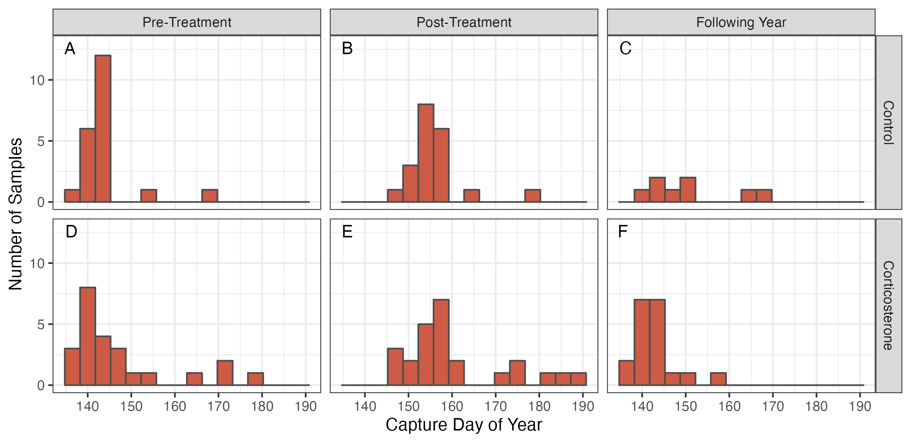\

**Within a year, short term effects of corticosterone dosing.** 

1. `A vs. D` No differences expected. False positives only. 

2. `A vs. B` Differences associated with breeding changes within individuals only. 

3. `D vs. E` or `D + A vs. E` Differences associated with short term cort dosing effects + breeding stage changes. 

4. `B vs. E` Only changes associated with short term cort dosing. 

**Across years, long term effects of corticosterone dosing.** 

5. `F vs. C` or `F vs. C + A + D` Long term effects of cort dosing. 

6. `F vs. E` Isolating long term effects of cort dosing that are NOT already present in short term. Also distinguishing which short term effects detected the previous year go away by one year later. 

# General description of Methylation

These are some general characteristics of methylation scores read out from `MethylKit`. I'm using just a subset of samples here since I can't read in all the samples simultaneously to memory, but they are consistent between samples so I think this is fine as a general illustration. If we think it is important I can combine these for all samples.

## Correlation profile

We can get an overall correlation between sites across samples to get a sense of how consistent the general methylation profile is. This can be output as a correlation matrix or as a plot, but the plot only really works for a few samples. Here is an example of just 5 pre-treatment samples from a random set of birds.

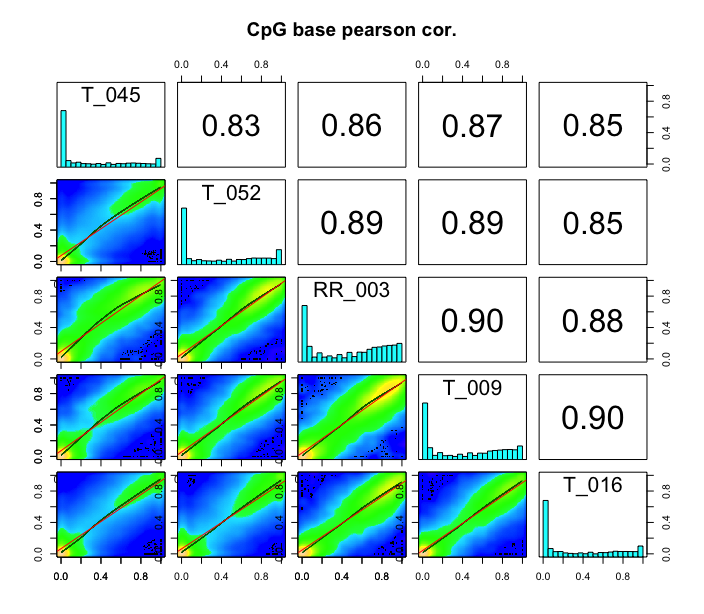\

## Correlation by sample

We could also use the correlation between samples to look at overall similarity of different individuals vs the same individual when sampled multiple times. Here is pre vs. post treatment correlation for the cort dosed birds only when sampled twice in the same year. I'm having problems loading the full set of samples into memory to look at this for all birds at once, but it seems like a clear enough pattern that I'm sure it won't change. Individuals are more closely correlated with themselves than with other birds. Kind of interesting, since it suggests that even though the overall genome wide methylation profile is very similar for all birds, there is also between-individual variation that is mostly stable over 10-14 days (will want to do this also for the across year samples).

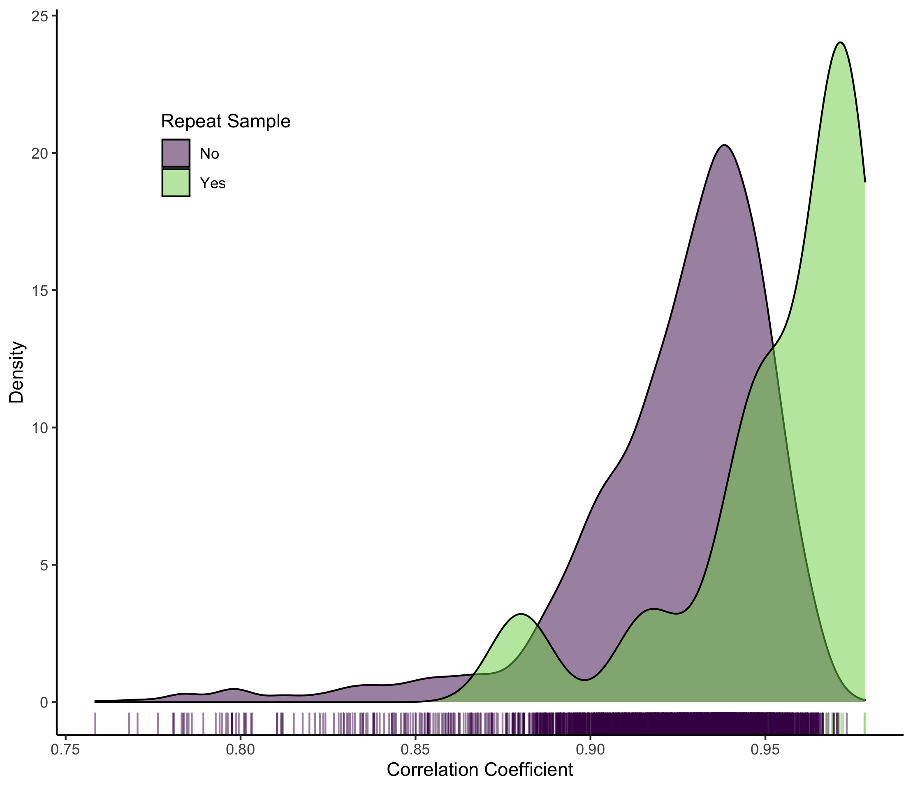\

## Variation by methylation

Because we are comparing below across many sites, there are some really strong corrections for multiple comparisons in these packages. Given our sample sizes, that could pretty much wipe out any chance to observe differences. One thing that some studies seem to do is to take out sites that don't meet some criteria before the comparison. For example, sites that don't show much/any variation between individuals or that have very high/low methylation levels might not be worth leaving in. Even if there **are** real biological differences at these sites, our power to detect them given our sample size and the effect sizes they would reflect is probably very low. There doesn't seem to be any sort of really standardized way to do this though. What I've done here is to plot the percent methylation at each CpG site vs. the standard deviation between samples at that same site (this is just for the pre-post cort birds, but the pattern is the same everywhere). It's pretty clear that the high and low sites don't vary much between individuals. As a starting point here, I've excluded sites that have SD < 10% between samples. This mostly gets rid of high and low sites, plus a smaller number of CpGs with middle methylation percentages. You can also see this threshold applied in the histogram plots with each comparison farther down. I'm open to suggestions about better ways to do this!

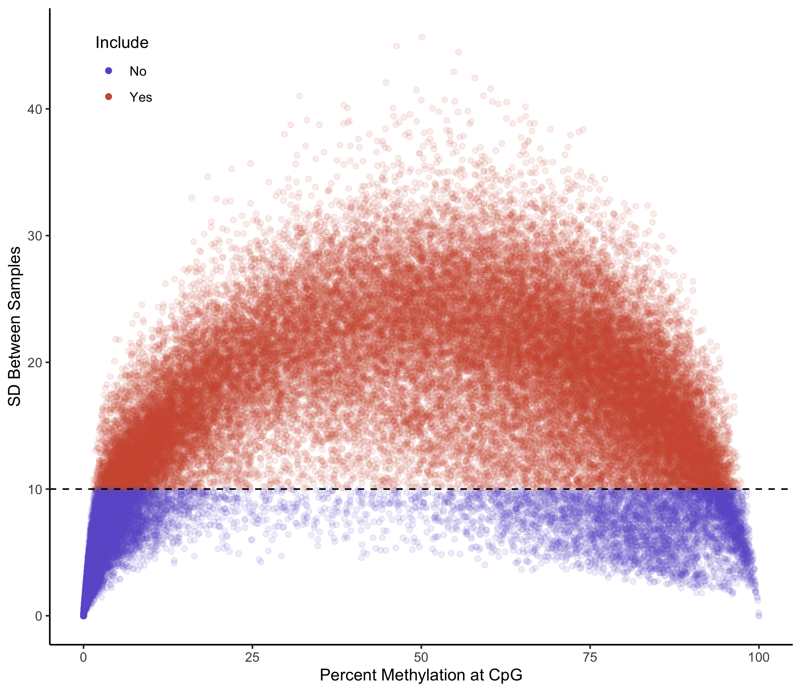\

## Distribution of CpG methylation

We can calculate global methylation percentage across all sites. This depends on which sites are included and for now I'm just ignoring NA values, so the exact sites aren't identical for each sample. This is also only showing the pre/post cort samples for now as an example. Overall the genome wide percentage is 39%, which seems quite close to some of the great tit papers. There also seems to be a fair amount of variation. It's also pretty similar to the 'raw' percentages I calculated above before accounting for variation in coverage.

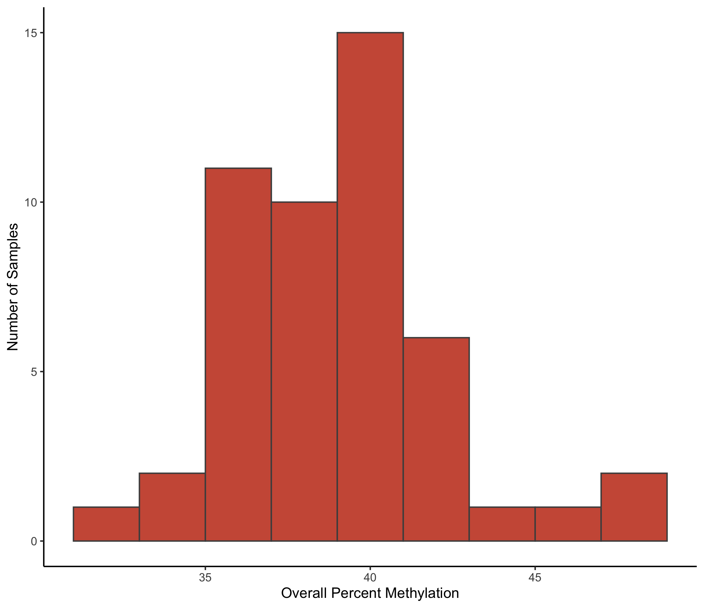\

## Distribution of coverage by site

I haven't done this yet. Not sure it is really very relevant. So far I am only including sites that have 10 reads for a sample and am only including sites that have 10 individuals per group with that coverage level. Depending on the comparison that gets us in the range of 50-100k CpG sites. I should calculate what the total number of CpGs in the genome is so that we can compare that number and then we should also split it out by genomic features once the annotation is ready.

# Group CpG comparison MethylKit

There are a lot of choices that can be made in these group comparisons. For example: 
- Minimum coverage (currently 10 reads per base pair) 
- Excluding high coverage sites because of bias (currently excludint sites > 99.9 percentile of coverage) 
- Include covariates? (not including any at the moment) 
- Minimum samples per treatment group to include a site (currently minimum of 15 samples per group) 
- Individual sites or tiling windows of xx bp (individual sites first, then tiling windows) 
- How to do multiple comparison corrections? 
- Exclude sites that are invariant or 0/100% before doing differentials? This 'increases power' by reducing the number of comparisons. 

This comparison is all using `MethylKit`, there are other packages and options available. This one seems pretty widely used and relatively easy to implement, but does not allow for some of the accounting for sample variation that the beta-binomial packages do and is much less flexible than just pulling into an lmer modeling framework (which is also possible). Anyway, as a first step, here are the MethylKit comparisons for each of the 6 group comparisons listed above. 

**Figure Explanation**

The figures for each comparison below are the same. Going from top left to right and then down each row, they are showing: 
- The distribution of raw p-values for each CpG. This distribution is used to determine q-values for false discover rate. All false effects would produce a uniform distribution, real effects should produce a hump up towards 0. 

- Each dot is a CpG site. The x axis is the difference in methylation between group 1 and group 2. The y axis is the q value. The dashed lines are at 0.05, 0.01, 0.001, 0.0001. 

- This is basically a manhattan plot although i don't have scaffolds mapped to chromosomes. Essentially the same info as the previous plot. 

- These three panels are principal component plots based on methylation of all the shared CpGs in the analysis. Each plot has PC 1/2/3 vs. another. 

- This is showing a smoothed line of the relationship between average methylation at a CpG (x axis) and average q value (y axis). Basically just showing that we find more low q-values at intermediate methylation. I don't think this is very useful for each comparison, can be ignored. 

- This is the full distribution of methylation percentages for individual CpGs as a histogram. The blue histogram is all CpGs with enough coverage to include. The red histogram is after excluding sites that have SD < 10% between samples (i.e., sites that are mostly invariant). On top it lists the total number of CpGs in this particular comparison. Note that the exact CpGs and number of CpGs included in each of the two way comparisons is not exactly the same. 

- This is showing the average methylation per CpG site (x axis) vs. the absolute difference in methylation percent between the two comparison groups (y axis). Unsurprisingly, sites with intermediate methylation overall have the biggest differences between groups. Like with the MeDIP, we will have hte most power to detect differences at sites with these characteristics where effect sizes can be larger. Not very useful, ignore. 

## Pre-Control vs. Pre-Cort (AvsD)

This should represent a baseline of no expected differences...obviously it is still picking up a lot of differences so something is wrong with the analysis. May need to try switching to a beta-binomial method outside of `MethylKit`.

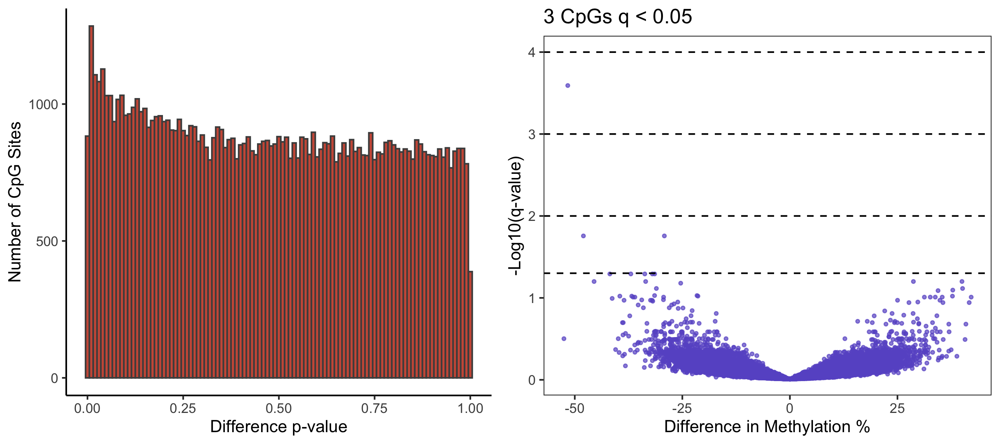\

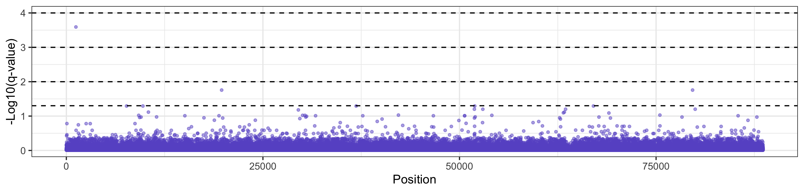\

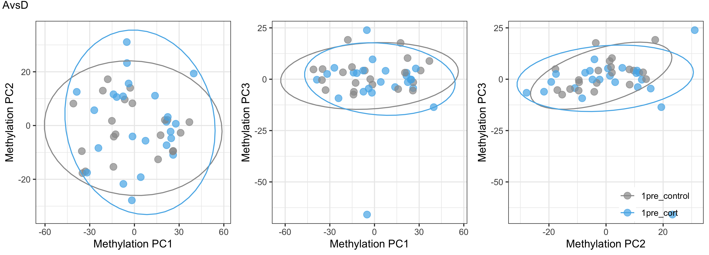\

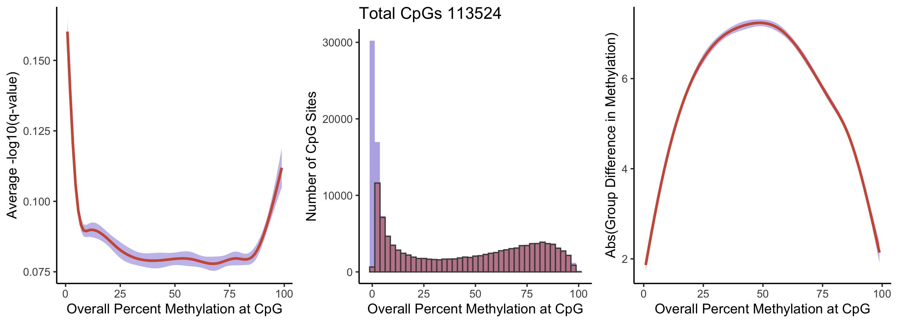\

## Pre-Control vs. Post-Control (AvsB)

This should pick up only changes associated with seasonal shifts.

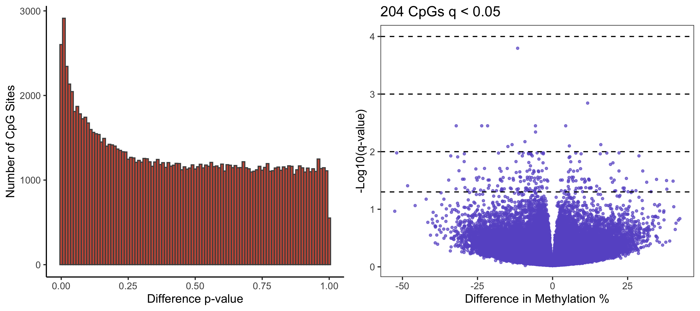\

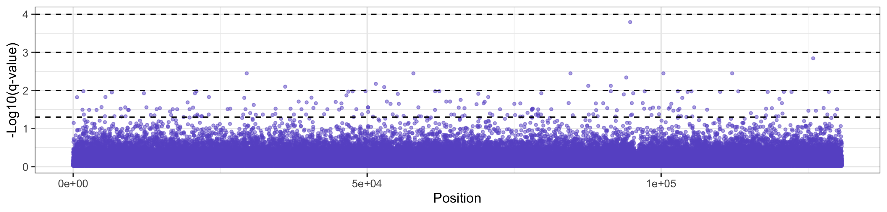\

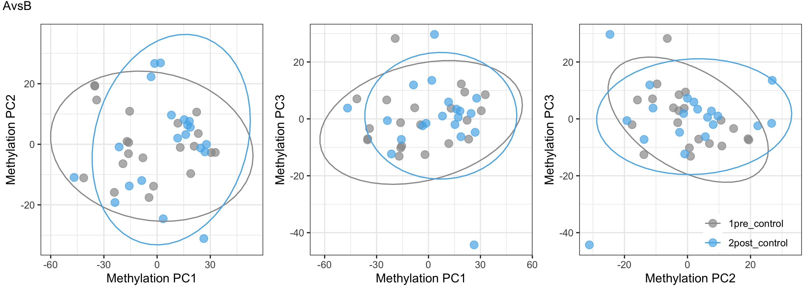\

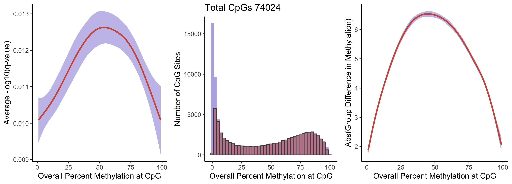\

## Pre-Cort vs. Post-Cort (DvsE)

This should pick up seasonal shifts plus direct cort dosing effects.

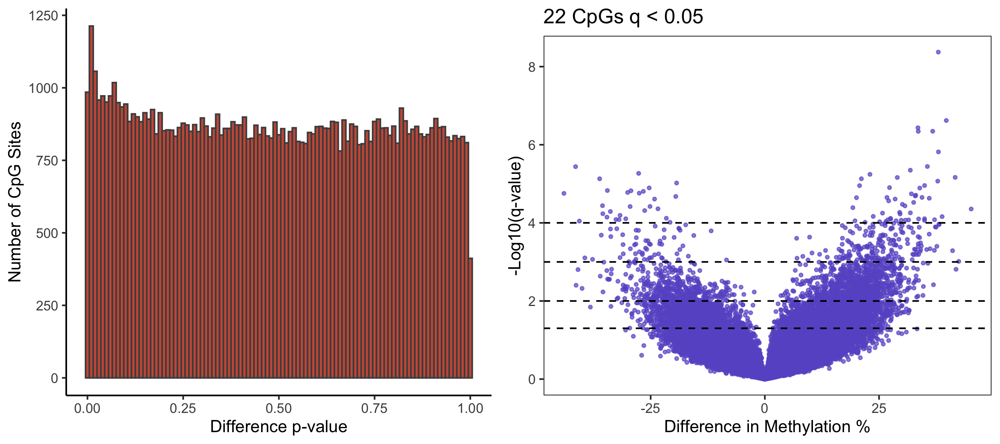\

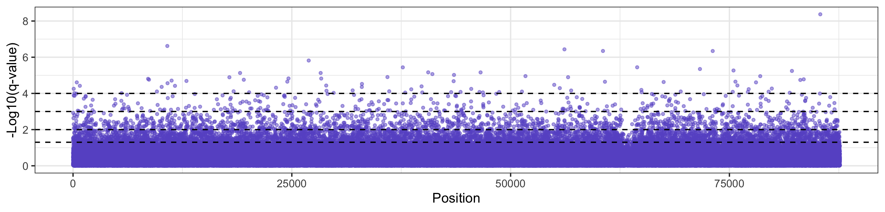\

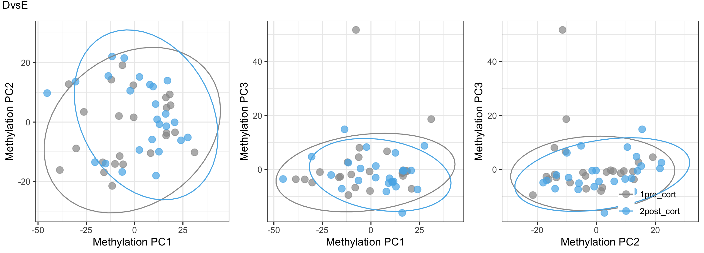\

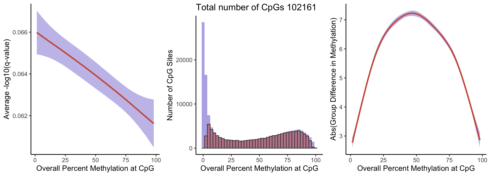\

Here is another way of plotting the PC1 vs. PC2 plot with arrows connecting the same individual from pre to post sampling. Most individuals increase in PC2. The comparison methods in `MethylKit` and `DSS` really aren't tracking this within individual change.

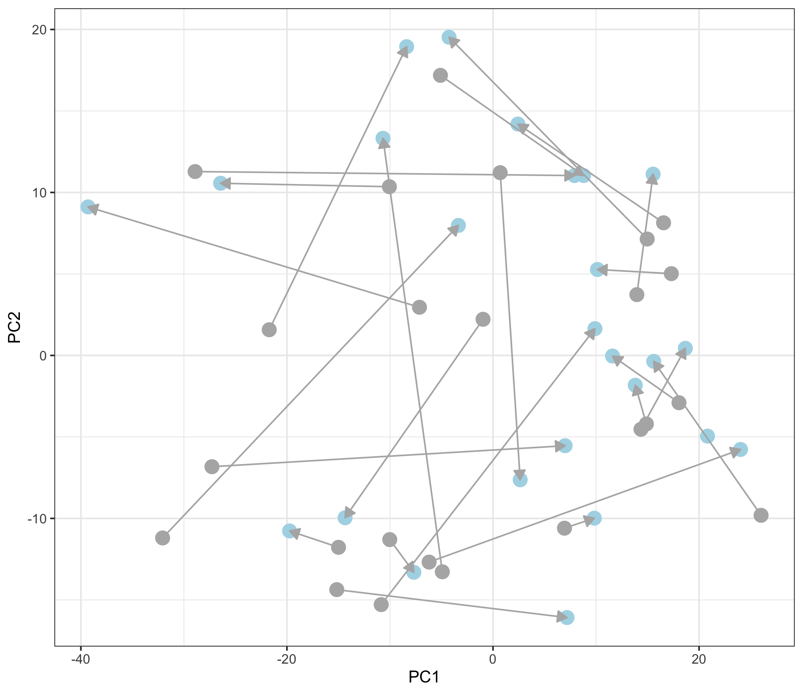\

## Post-Control vs. Post-Cort (BvsE)

This should pick up only direct cort dosing related effects.

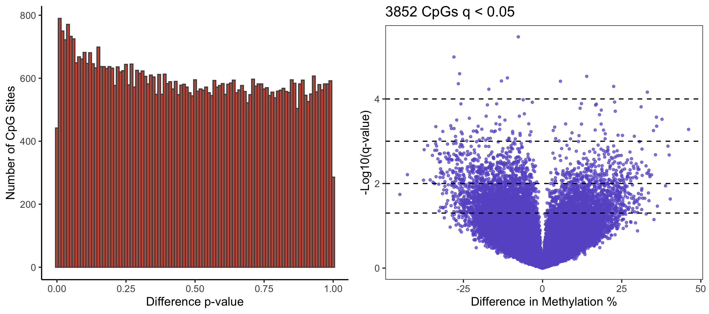\

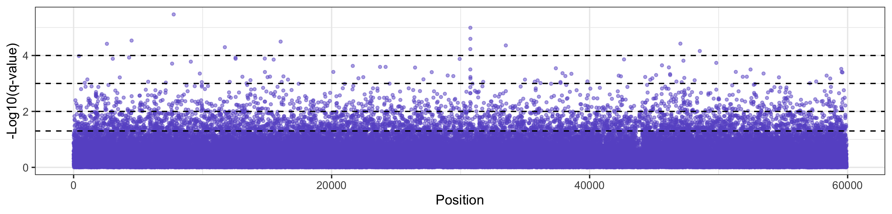\

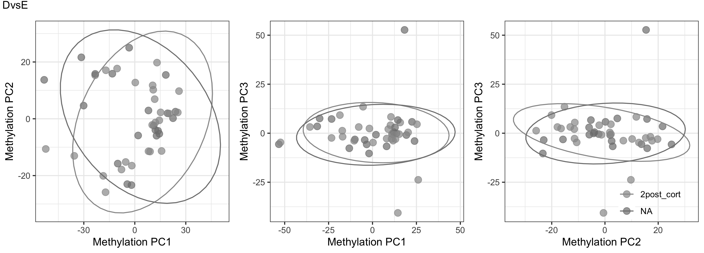\

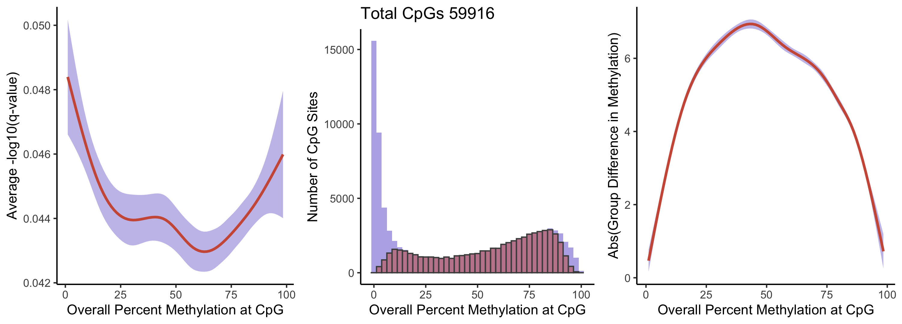\

## Carryover (F vs C+A+D)

This should mostly pick up carryover effects of cort dosing. We don't have enough to only include year n+1 control birds in a comparison group, so I'm including pre-treatment samples from the previous year too. Those are mixed age and are free of cort carryover, so should be OK, but the comparison is a bit different.

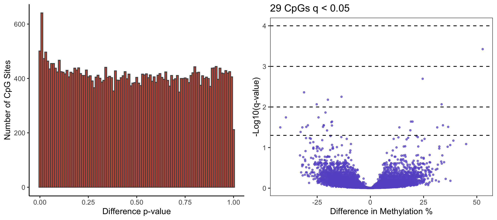\

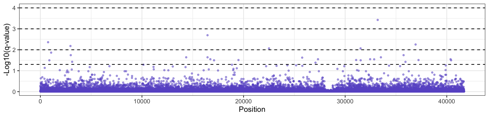\

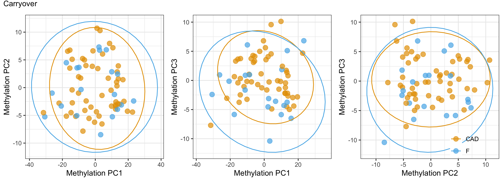\

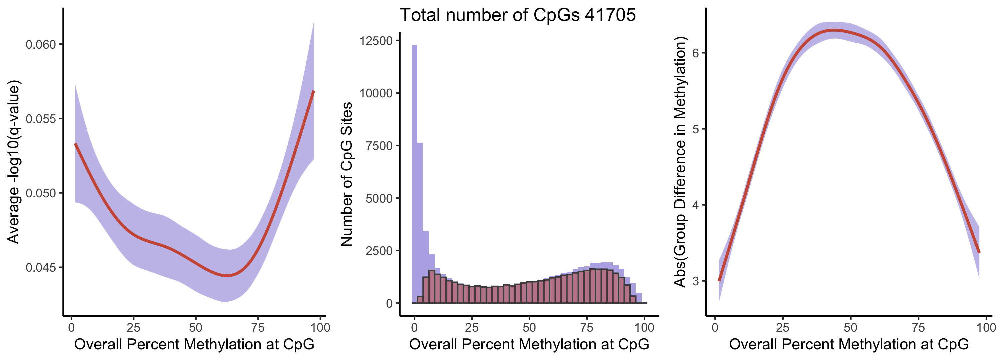\

# Genomic Features Annotation

We can use the new genome to split out methylation by genomic features since the function is expected to differ for promoters/introns/exons/CpG islands, etc. First, I turned the gff annotation that Leo sent into a bed file annotation that MethylKit wants using `BEDOPS v2.4.39` and the `gff2bed` script with this command:

```
gff2bed < TRES_annotation.gff > TRES_annotated.gff.bed

gffToGenePred < TRES_annotation_genes.gff > TRES_genepred

awk -F '\t' '$3 ~ "^gene|exon|CDS|mRNA"' TRES_annotation.gff > TRES_annotation_genes.gff
cat TRES_annotation_genes.gff | cut -f3 | sort -u

awk -F '\t' '$3 !~ "^match_part"' TRES_annotation.gff > TRES_annotation_no_part.gff

awk -F '\t' '$3 !~ "^match_part"' TRES_1000lines.gff | head 
```
