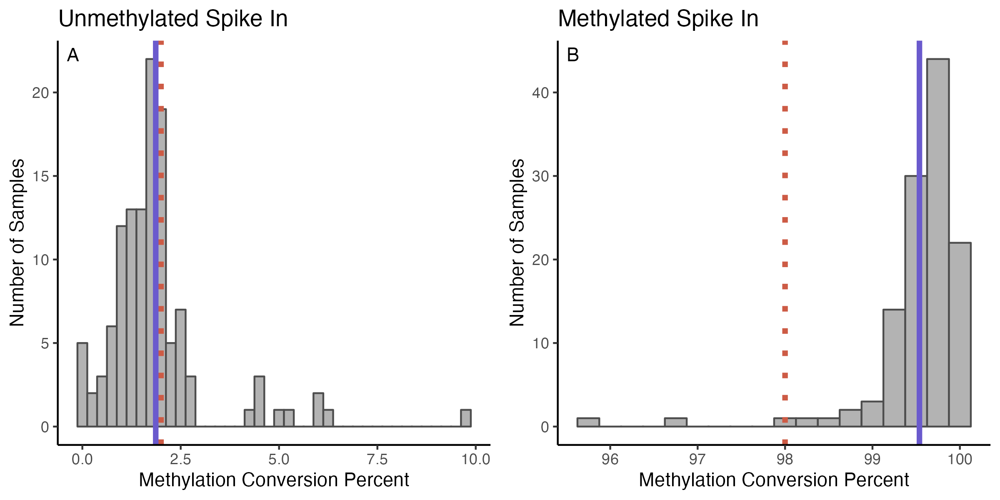
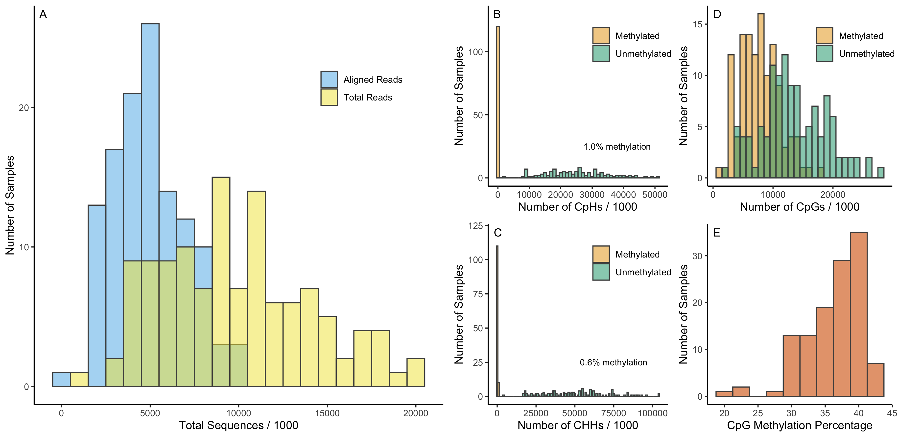
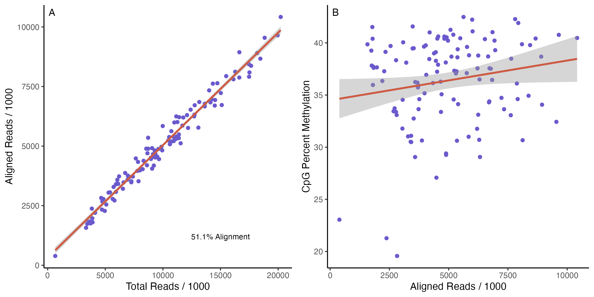

# Lab Work and Sequencing

  I basically followed exactly along with the methods from the Diagenode kit with some very minor adjustments so I'm not going to describe it here. I have a file with all the lab notes and sample details. Sequencing was at BRC and I have the details of PhiX and cluster density, etc recorded.
  
# Initial BioInformatics Processing

The first steps of processing were all done using the BioHPC cloud computers. I'm reproducing the list of commands that I entered here with some descriptions, though actually running these commands would require putting all the files up to the cloud and navigating to run each command from the right directory.

## Trimming Sequences

1. First I trimmed all of the raw sequence files with `Trim Galore!` using this command:

```
trim_galore *_R1.fastq.gz --rrbs --fastqc -o output/
```

I looked at a subset of the fastqc files produced by `Trim Galore!` and they all looked very good in terms of quality. I'm not sure if there is something from that output we should report quantiatively, or if it's just enough to say 'they looked good'. 

## Aligning and Calling Each Sample

2. Next I moved to `Bismark` v0.16.1 for bisulfite alignment. There are some details on setting up the BioHPC environment to have bismark in the path that I won't list here. The first real command was to index the tree swallow genome that Leo had assembled.

```
bismark_genome_preparation /directory/with/genome
```

3. Then align each sample to the genome. To run all samples I made a shell script to loop through called `bis.align.sh`. The command for a single sample was:

```
bismark --multicore 4 /directory/bismark_genome file_trimmed.fq.gz
```

4. Next I extract the methylation information from each sample. Again, I looped through with a shell script called `bis_extract.sh` and the command for a single file was:

```
bismark_methylation_extractor --single-end --multicore 4 --gzip --bedGraph file_bt2.bam
```

5. Last, I created summary reports with `bismark2summary`. The output from #4 above was used as the input for `MethylKit` described below.

## Checking Methylation Conversion  

6. Separately from actual sample sequences above, I followed a similar procedure to determine the methylation conversion efficiency for methylated and unmethylated spike-in controls included with each sample. This is also described in the Diagenode manual. The commands are exactly as described above except that they use the 'genome' of the spikes for alignment and they use an additional file that includes the position of each methylated or unmethylated 'C' to allow for calculation of conversion in the end. The exact commands are saved in `bis_meth_convert.sh` and are identical to the kit directions.
  
# Quality Control Plots

## Methylation Conversion

\

**Figure x.** Estimates of methylation conversion from bisulfite treatment for unmethylated (A) and methylated (B) spike-in controls. Histograms show values for each sample, blue lines indicate the average across all samples, and red dashed lines show the kit suggested average targets to indicate that conversion was effective.

## Raw Reads and Alignment

\

**Figure x.** Summary of sequencing and methylation call results from raw sequence data. A: Distribution of the total number of sequences for each sample and number of sequences that aligned to the tree swallow genome. B: Number of CpH sites that were methylated or unmethylated. C: Number of CHH sites that were methylated or unmethylated. D: Number of CpG sites that were methylated or unmethylated. E: Percentage of CpG reads that were methylated by sample. Note that these histograms are based on raw scores that do not account for differential coverage between samples or locations in the genome and are shown for illustration only. 

## Alignment and Methylation

\

**Figure x.** The number of reads that aligned to the genome scaled linearly with the total number of reads per sample (A). Samples that had more aligned reads had slightly higher overall methylation percentages for across all CpG scores (B), but the relationship was weak and driven by three samples with low reads and low methylation percentages. Note that methylation percentage here is based on raw scores that do not account for differential coverage between samples or location in the genome.

